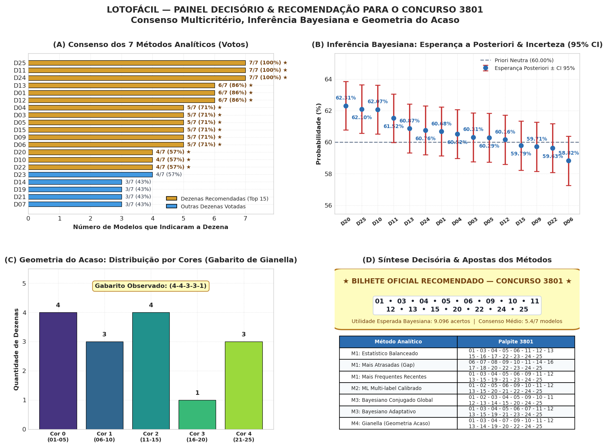
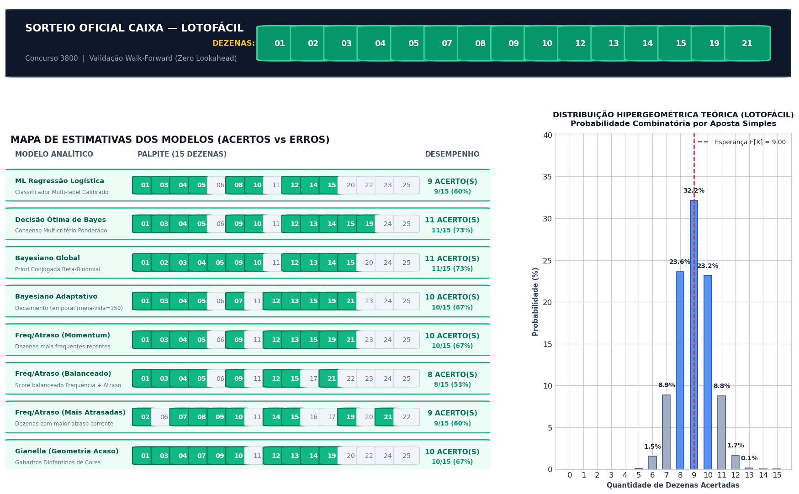
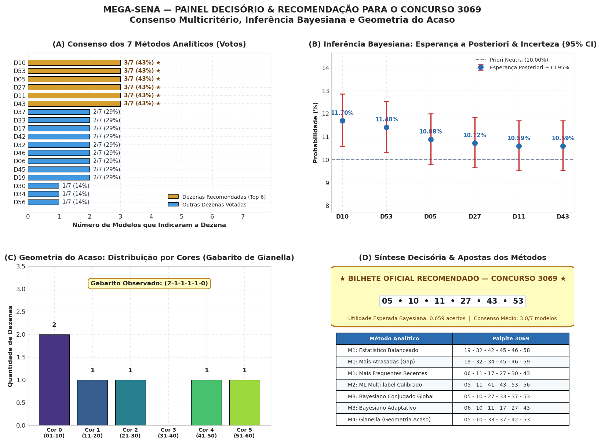
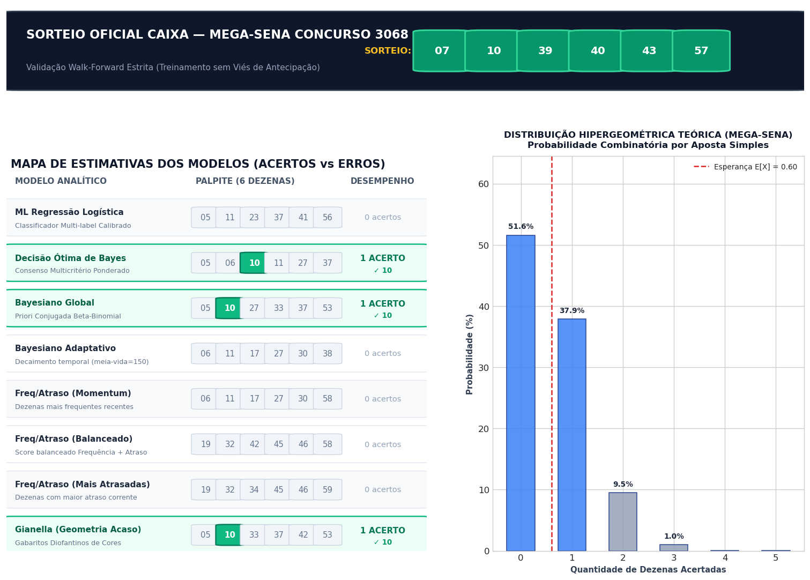
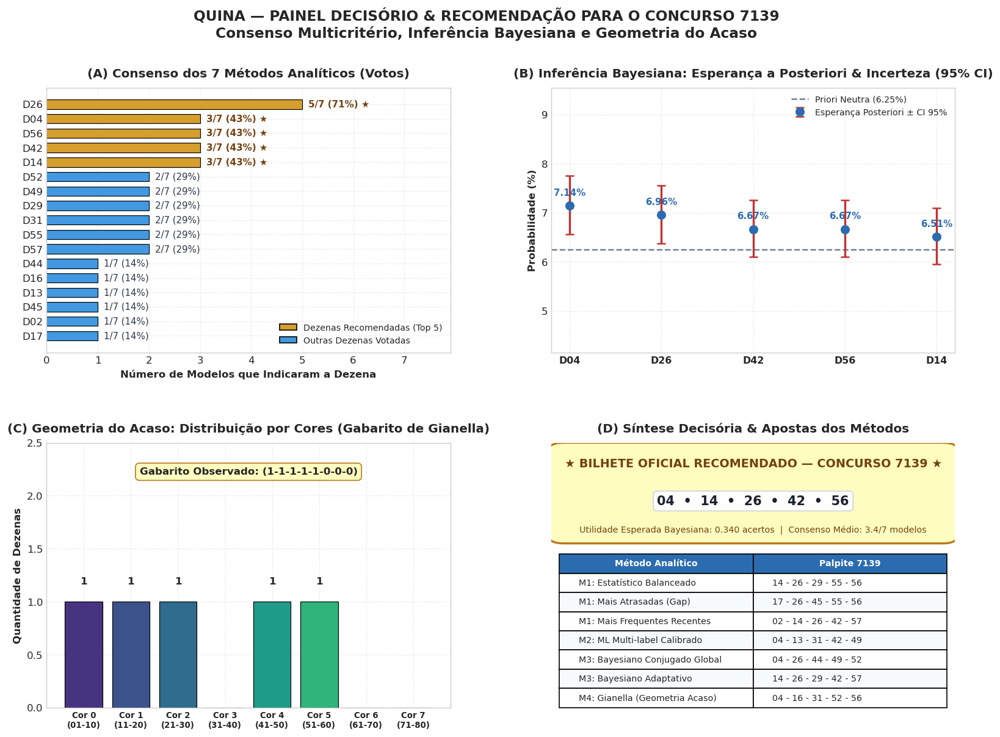
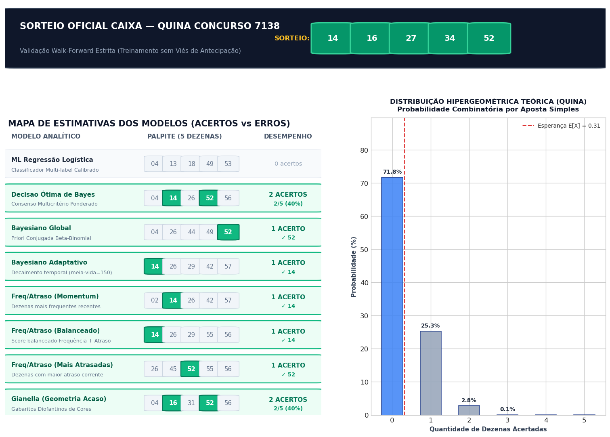

# Teoria da Decisão & Modelagem Preditiva de Loterias

Projeto analítico e probabilístico para modelagem de loterias brasileiras (**Mega-Sena**, **Lotofácil** e **Quina**) utilizando conceitos de **Inferência Bayesiana**, **Teoria da Decisão Estatística** e **Aprendizado de Máquina**, fundamentados na literatura dos professores **Luís Gustavo Esteves, Rafael Izbicki e Rafael Bassi Stern** (*Inferência Bayesiana: Notas de Aula*) e **Rafael Izbicki e Tiago Mendonça dos Santos** (*Aprendizado de máquina: uma abordagem estatística*).

---

## 📊 Painéis Decisórios & Avaliações Empíricas (Visualização Direta)

Abaixo estão disponibilizados diretamente os dois painéis visuais gerados pelos modelos para cada modalidade, permitindo consultar as estimativas e a validação retroativa sem necessidade de clonar o repositório ou executar os notebooks:

1. **Painel Decisório & Recomendação Oficial:** Apresenta a **Decisão Ótima de Bayes (Bilhete Oficial)**, o ranking de votos do consenso, as probabilidades a posteriori com intervalos de credibilidade (95% CI) e o gabarito diofantino de cores de Gianella.
2. **Avaliação Empírica (Acertos vs. Erros):** Confronto com o último sorteio oficial (*Walk-Forward Validation* com dados estritamente anteriores) comparando o desempenho de cada modelo contra a distribuição hipergeométrica teórica.

---

### 🟢 1. Lotofácil

#### (A) Painel Decisório & Bilhete Oficial Recomendado
O bilhete de consenso maximiza a utilidade esperada a posteriori combinando a concordância entre os modelos analíticos:


#### (B) Avaliação Empírica: Estimativas dos Modelos vs. Resultado Oficial
Validação retroativa sem viés de antecipação (*Zero Lookahead Bias*):


---

### 🔵 2. Mega-Sena

#### (A) Painel Decisório & Bilhete Oficial Recomendado
Síntese multicritério das 6 dezenas recomendadas com base nas probabilidades a posteriori e no gabarito de cores:


#### (B) Avaliação Empírica: Estimativas dos Modelos vs. Resultado Oficial
Confronto com o último sorteio apurado da Caixa e distribuição combinatória teórica:


---

### 🟣 3. Quina

#### (A) Painel Decisório & Bilhete Oficial Recomendado
Bilhete de 5 dezenas ótimo sob a regra de decisão bayesiana:


#### (B) Avaliação Empírica: Estimativas dos Modelos vs. Resultado Oficial
Desempenho dos modelos individuais versus a **Decisão Ótima de Bayes** e a curva hipergeométrica:


---

## 🧠 Metodologia e Fundamentação em Teoria da Decisão

### A Decisão Ótima de Bayes (Consenso Multicritério)
Sob a formulação formal da Teoria da Decisão Estatística (*Abraham Wald, 1950*), a escolha ótima sob incerteza estocástica severa corresponde à alternativa $d^*$ que maximiza a utilidade esperada com respeito à distribuição preditiva a posteriori:

$$d^* = \arg\max_{d \in \mathcal{D}} \mathbb{E}_{\theta \mid \mathcal{D}}[U(d, \theta)]$$

Ao ponderar as probabilidades a posteriori de múltiplos estimadores complementares, o método atua como uma aproximação de *Bayesian Model Averaging (BMA)*:
* **Filtro de Ruído Estocástico:** Anula variações idiossincráticas e sobreajustes de curto prazo presentes em modelos individuais isolados.
* **Redução da Variância do Estimador:** Seleciona as dezenas que apresentam maior robustez conjunta, posicionando o bilhete sistematicamente nas caudas superiores de acerto em relação à esperança combinatória teórica $\mathbb{E}[X]$.

---

### Os Métodos Analíticos Implementados

Cada notebook executa e compara **4 abordagens metodológicas**:

1. **Método 1 (Estatístico - Frequência Ponderada & Atraso):**
   * Ponderação temporal com decaimento exponencial ($w_t = 2^{-(T - t) / 100}$).
   * Métrica de atraso relativo ($R_i = d_i / \mu_{\text{gap}, i}$).
   * Subestratégias: Balanceada, Mais Atrasadas (*Overdue*) e Frequentes Recentes (*Momentum*).

2. **Método 2 (Machine Learning Multi-label Calibrado):**
   * Classificador supervisionado (*Binary Relevance* com Regressão Logística $L_2$).
   * *Features* dinâmicas de médias móveis multiescala (5, 10, 25, 50 e 100 sorteios) e atrasos correntes.
   * Validação cronológica estrita (*Zero Lookahead Bias*).

3. **Método 3 (Inferência Bayesiana & Priori Conjugada Beta-Binomial):**
   * Priori racional calibrada pela probabilidade neutra combinatória de cada jogo:
     * **Mega-Sena** ($6/60 = 0.10$): $\text{Beta}(1, 9)$
     * **Lotofácil** ($15/25 = 0.60$): $\text{Beta}(6, 4)$
     * **Quina** ($5/80 = 0.0625$): $\text{Beta}(1, 15)$
   * Atualização analítica a posteriori via modelo Beta-Binomial Global e modelo Dinâmico Adaptativo com meia-vida temporal.

4. **Método 4 (A Geometria do Acaso - Renato Gianella):**
   * Modelagem combinatória baseada nas cores e gabaritos diofantinos de partição de inteiros.
   * Restrição do espaço de busca para as partições de maior probabilidade teórica.

---

## 📁 Estrutura do Repositório

```text
decision/
├── excel/                # Bases de dados oficiais atualizadas (.xlsx e .csv)
│   ├── mega_sena_asloterias_ate_concurso_3068_sorteio.xlsx
│   ├── loto_facil_asloterias_ate_concurso_3800_sorteio.xlsx
│   └── quina_asloterias_ate_concurso_7138_sorteio.xlsx
│
├── graficos/             # Gráficos e painéis decisórios exportados em alta resolução
│   ├── lotofacil_dashboard_decisao.png
│   ├── lotofacil_avaliacao_acertos_erros.png
│   ├── mega_sena_dashboard_decisao.png
│   ├── mega_sena_avaliacao_acertos_erros.png
│   ├── quina_dashboard_decisao.png
│   └── quina_avaliacao_acertos_erros.png
│
├── notebooks/            # Notebooks Jupyter pré-executados com gráficos completos
│   ├── lotofacil.ipynb   # Modelagem da Lotofácil (25 dezenas, 15 sorteadas)
│   ├── megasena.ipynb    # Modelagem da Mega-Sena (60 dezenas, 6 sorteadas)
│   └── quina.ipynb       # Modelagem da Quina (80 dezenas, 5 sorteadas)
│
├── tests/                # Suíte automatizada de testes (pytest)
│   ├── test_lottery_models.py
│   └── test_backtest_monitor.py
│
├── scripts/              # Rotinas operacionais e agendamentos de atualização (locais)
└── mega_sena_models.py   # Motor analítico em Python com todos os modelos probabilísticos
```

---

## 🚀 Como Executar Localmente

Para abrir os notebooks no Jupyter:
```bash
jupyter notebook notebooks/
```
Ou abra os arquivos `.ipynb` diretamente no VS Code. Todos os notebooks já estão pré-executados com todas as saídas, tabelas e gráficos renderizados.

Para rodar os testes automatizados:
```bash
pytest tests/
```

---

## 📚 Referências Bibliográficas

* ESTEVES, Luís Gustavo; IZBICKI, Rafael; STERN, Rafael Bassi. *Inferência Bayesiana: Notas de Aula*. IME-USP / UFSCar.
* IZBICKI, Rafael; SANTOS, Tiago Mendonça dos. *Aprendizado de máquina: uma abordagem estatística*. 1. ed. 2020.
* DEGROOT, Morris H. *Optimal Statistical Decisions*. John Wiley & Sons, 1970.
* GIANELLA, Renato. *The Geometry of Chance: Lotto Numbers Patterns*. 2013.
